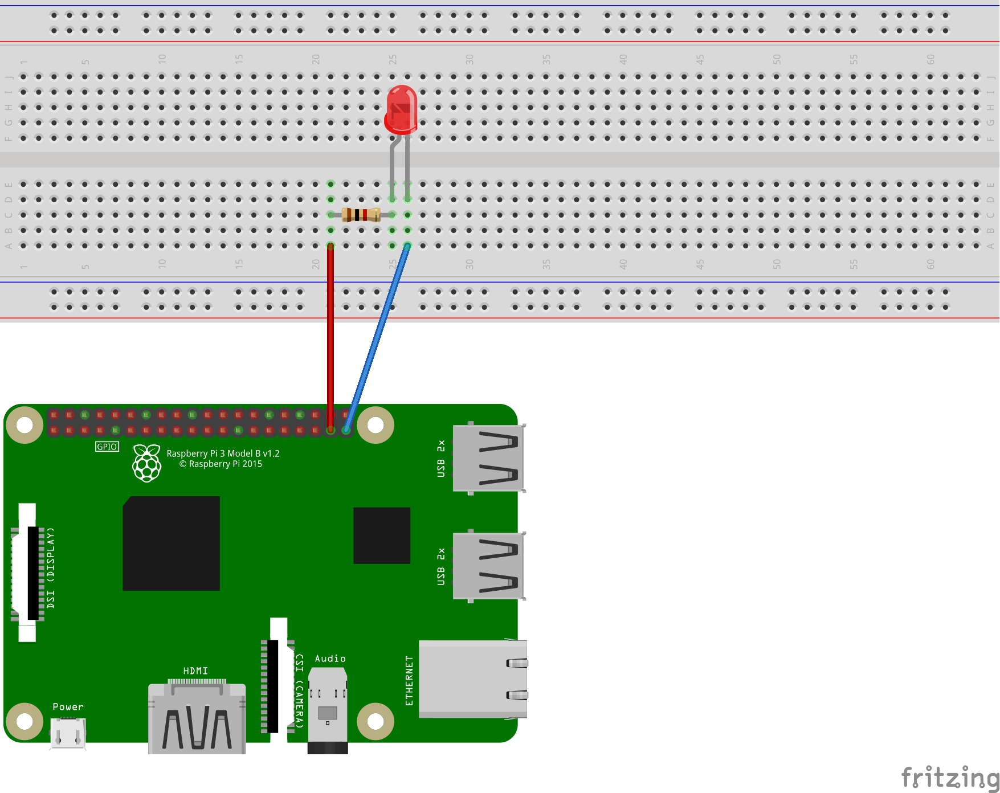

# 山口大学工学部 ワークショップ 2019  解説資料

---

## 第3章 GPIO(General Purpose Input/Output)を使う

---

### 1. GPIOの制御

Raspberry Piには40本のGPIO（入出力端子）が備えられており、これらのピンにLEDやセンサなどの電子部品を接続・制御することができる。  
これらの40本のGPIOにはそれぞれ機能が割り当てられており、GPIOを使用しようとするときには、各GPIOの機能を把握しておかねばならない。  
GPIOに割り当てられた機能の詳細については以下のサイトで確認できる。いずれも記載されている内容は同じである。

[RaspberryPi2のPin配置](http://www.ic.daito.ac.jp/~mizutani/raspi/raspi_pins.html)  
[ツール・ラボ >> 第22回 Raspberry PiのGPIO概要 ](https://tool-lab.com/make/raspberrypi-startup-22/)  
[ラズパイの出力電圧を確認してみた](https://qiita.com/takeru56/items/985ae67f97def2218208)  

Raspberry Piを裏返したときに、GPIOの根本の半田部分が1本だけ四角くなっている（他は円形）。これが1番ピンである。
1番ピンを目印として、上記サイトで示されているピン配置図と実際のピンの並びを比較する。

GPIOの配置や、現在の各ピンの状態などは、コマンドラインからも確認/変更することができる。  
`WiringPi`というパッケージを用いる。Raspbianには最初からインストールされている。  
[コマンドラインからGPIOを操作する - IT父さんのロボブログ](http://tomaberry.hatenablog.com/entry/2017/02/12/155910)

一例として、GPIO26を使用して、LEDを点灯/消灯させてみる（Lチカ）。  
1. Raspberry PiにLEDを接続するために以下のような回路を作る。  
  

使用した抵抗の抵抗値を読んでみよう。抵抗早見表は以下。  
[http://part.freelab.jp/s_regi_list.html](http://part.freelab.jp/s_regi_list.html)  
また、回路に抵抗を入れる意味について考えてみよう。

2. GPIO26の現在の状態を確認  
`$gpio readall` 
3. GPIO26を出力に設定  
`$gpio -g mode 26 out`  
4. 設定が反映されたか確認  
`$gpio readall`  
5. GPIO26をHIGH（3.3V）にする。GPIO26に電流が流れ、LEDが点灯する。  
`$gpio -g write 26 1`  
6. 設定が反映されたか確認  
`$gpio readall`  
7. GPIO26をLOW（0V）にする。GPIO26に電流が流れなくなり、LEDが消灯する。  
`$gpio -g write 26 0`  
8. 設定が反映されたか確認  
`$gpio readall`  

---

[前の章へ](https://yu-workshop2019.github.io/chapter_2/chapter_2)

[次の章へ](https://yu-workshop2019.github.io/chapter_4/chapter_4)

[目次へ](https://yu-workshop2019.github.io/manual)

[トップページへ](https://yu-workshop2019.github.io/)
