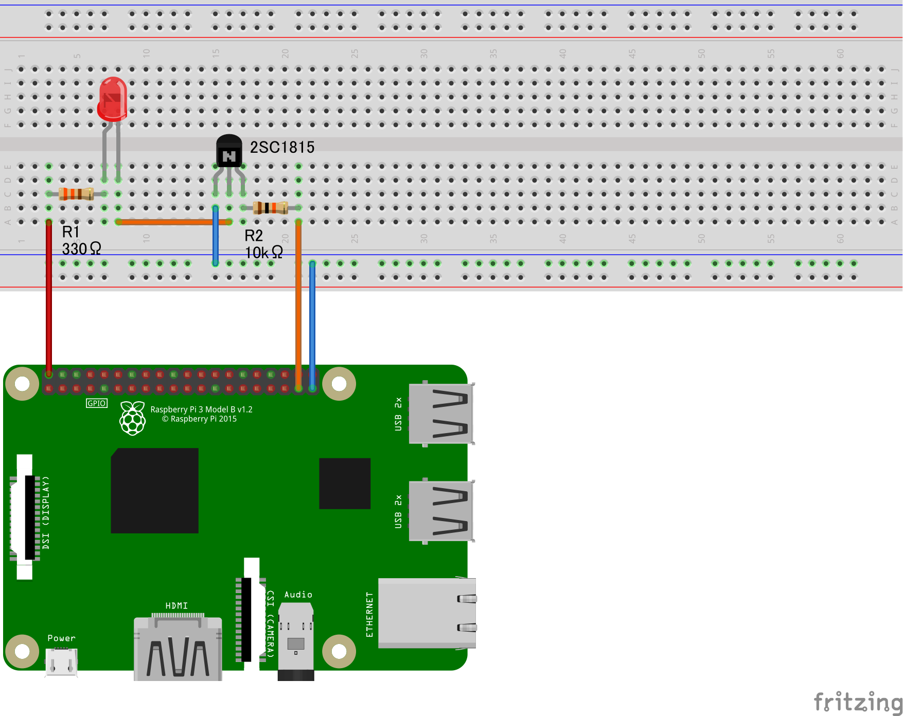
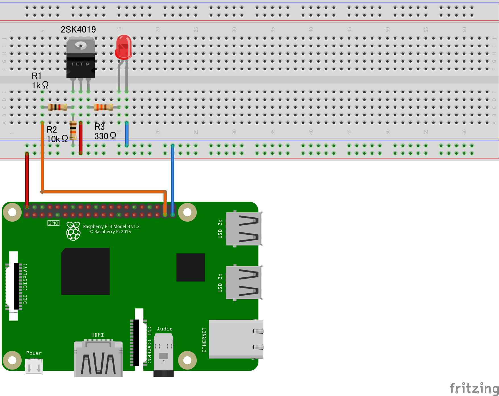

# 山口大学工学部 ワークショップ 2019  解説資料


---

## 第5章 さまざまな電子部品の接続

---


### 1. Raspberry Piに様々な電子部品を接続する
第3章では、Raspberry PiにLEDを接続して点灯/消灯を制御した。この他にも、モータ・センサなどのような様々な電子部品をRaspberry Piに接続して制御すると、ソフトウェアだけでは実現できない様々なデバイスを製作することが可能になる。  
本章では、さまざまな電子部品とその使用例を簡潔に紹介し、自分が実現したいデバイスを製作するためのヒントとなることを目的とする。
以下の項目の中で興味をひかれたものを試してみよう。

---

### 参考:GitHubからのサンプルコードの一括ダウンロード

山口大学工学部ワークショップ2019で使用するサンプルコードは、GitHubと呼ばれるコード共有サービスを利用して公開している。 
これらのサンプルプログラムはその都度コピペして使用することもできるが、より効率的に、あらかじめ一括してダウンロードしておく方法もある。  
山口大学工学部ワークショップ2019で使用するサンプルコードをGitHubから一括してダウンロードするには、次の手順に従う。

1.[https://github.com/yu-workshop2019/yu-workshop2019_docs](https://github.com/yu-workshop2019/yu-workshop2019_docs)にアクセスする。  
2.画面右上の方にある、`Clone or Download`というボタンをクリック。  
3.`Download Zip`というボタンをクリック。  
4.圧縮されたZipファイルがダウンロードされるので適当な方法で解凍する。  

<b>Raspberry Piで学外のWebサイトが閲覧できない不具合が複数見られています。  
  [第2章 Raspberry Piの初期設定](https://yu-workshop2019.github.io/chapter_2/chapter_2)の「9.Webの閲覧」部分に対策を追記しました。  
  Raspberry PiでWebが閲覧できない人は試してみて下さい。</b>

---

### 2.LEDの点滅を制御

第3章では、Raspberry PiにLEDを接続して点灯/消灯を制御した。これをプログラムによって制御したい。
[第3章](https://yu-workshop2019.github.io/chapter_3/chapter_3)で作ったLEDの回路を用いる。


1.WiringPi-Pythonのインストール  
ターミナル上で以下のコマンドを実行し、PythonでRaspberry PiのGPIOを制御するためのライブラリを導入する。
（大変長いので、Raspberry Pi上のブラウザでこのページを表示させ、ターミナルにコピペすることを推奨）

`$sudo apt-get update`  
`$sudo apt-get install git`  
`$git config --global http.proxy http://proxy.cc.yamaguchi-u.ac.jp:8080`  
`$git config --global https.proxy http://proxy.cc.yamaguchi-u.ac.jp:8080`  
`$sudo rm -rf WiringPi-Python`  
`$sudo apt-get install python-dev python-setuptools swig`  
`$git clone --recursive https://github.com/WiringPi/WiringPi-Python.git`  
`$cd WiringPi-Python/WiringPi`  
`$sudo ./build`  
`$cd ..`  
`$swig -python wiringpi.i`  
`$ sudo python setup.py install`  
`$sudo python3 setup.py install`  

2.LEDを点滅させるためのPythonプログラムをダウンロード  
以下のページから、LEDを点滅させるためのPythonプログラムをダウンロードし、`/home/pi`にコピーする。
[https://github.com/yu-workshop2019/yu-workshop2019_docs/blob/master/lchica.py](https://github.com/yu-workshop2019/yu-workshop2019_docs/blob/master/lchica.py)

3.実行権限の追加

`$cd`  
`$sudo chmod a+x ./lchika.py`  

4.プログラムの実行  
WiringPi-Pythonを使用したPythonプログラムは、管理者権限(sudo)で実行する。  

`$sudo python ./lchika.py`  

5.プログラムの改良  
点滅速度や点滅の割合を変更するとどうなるか確認してみよう。
また、LEDのON/OFFだけでなく、明るさを変更するにはどうすればよいか考え、実験してみよう。

---

### 3.温度・湿度・気圧センサ BME280

温度・湿度・気圧を1台で測定できるセンサ、BME280を用いて、Raspberry Piをデジタル百葉箱にしてみよう。


1.BME280のはんだ付け  
BME280にピンヘッダをはんだ付けする。また、<u>J3と書かれた部分の金属面にもはんだを盛る。</u>
BME280のデータシートは以下。  
[http://akizukidenshi.com/download/ds/akizuki/AE-BME280_manu_v1.1.pdf](http://akizukidenshi.com/download/ds/akizuki/AE-BME280_manu_v1.1.pdf)

2.BME280とRaspberry Piの配線  
ジャンプワイヤを用いて、以下のようにRaspberry PiとBME280を接続する。配線を間違えないよう注意。
Raspberry Piのピン配置については以下を参照。  

[raspi_gpio_assign.jpg](https://yu-workshop2019.github.io/chapter_3/raspi_gpio_assign.jpg)

```
BME280 | GPIO
--------------
  VDD  | 3.3V
  GND  | GND
  CSB  |  NC
  SDI  | SDA1
  SDO  | GND
  SCK  | SCL1
  
  NC:未接続
```


3.Raspberry PiでI2Cの使用を許可  
BME280は、I2C（アイツーシ－）と呼ばれる通信規格でデータをRaspberry Piに送信する。
Raspberry PiでI2Cが使用できるように設定を変更する。
raspi-configの"Interfacing Option"にある。

`$sudo raspi-config`

4.I2C用のライブラリをインストール  
PythonでI2Cを使用するためのライブラリをインストールする。ターミナルで以下のコマンドを実行。

`$sudo apt-get install i2c-tools`  
`$sudo apt-get install python-smbus`  

5.BME280が認識されているかの確認  
ターミナルで以下のコマンドを実行。

`$sudo i2cdetect -y 1`  

BME280が正しく接続され、Raspberry Piから認識されているならば、"76"などの数字が表示される。
そうでない場合には、もう一度配線を確認してみる。

6.サンプルプログラムの入手・修正  
SWITCH SCIENCE という会社が公開してくれている、BME280から気温・湿度・気圧を取得して表示するプログラムを以下のページからダウンロードし、`/home/pi`にコピーする。  
[https://github.com/SWITCHSCIENCE/BME280/blob/master/Python27/bme280_sample.py](https://github.com/SWITCHSCIENCE/BME280/blob/master/Python27/bme280_sample.py)  

ダウンロードした`bme280_sample.py`をnanoなどで開き、3行目を以下のように修正する。

修正前:`from smbus2 import SMBus`  
修正後:`from smbus import SMBus`

7.実行権限の追加

`$cd`  
`$sudo chmod a+x ./bme280_sample.py`  


8.サンプルプログラムの実行  
ターミナル上で以下のコマンドを実行。気温・湿度・気圧が表示されるはず。

`$sudo python /home/pi/bme280_sample.py`

センサ部分に息を吹きかけたりすると気温や湿度が変化するのがわかる。

9.連続的な値の取得とファイルへの出力  
BME280から連続して値を取得し、Raspberry PiのmicroSDカードに書き込むように変更する。  
以下のサイトからプログラムをダウンロードし、`/home/pi`にコピーする。  
[https://github.com/yu-workshop2019/yu-workshop2019_docs/blob/master/bme280.py](https://github.com/yu-workshop2019/yu-workshop2019_docs/blob/master/bme280.py)

10.実行権限の追加と実行

`$cd`  
`$sudo chmod a+x ./bme280.py`  
`$sudo python ./bme280.py`

停止するときにはターミナル上で`Ctrl+C`を押す。

`/home/pi`に、ファイル名に日付を含み、拡張子が`.csv`であるファイルができているはず。
これをExcelなどで開いてみよう。1秒ごとの温度・湿度・気圧が記録されている。
グラフなどを作成してみると、一日の気温・湿度・気圧の変化が視覚的に確認しやすい。

11.Pyhonで簡易Webサーバを構築し、リアルタイムでデータを閲覧  
以下のサイトから、`bme280`というフォルダをダウンロードし、`/home/pi`にコピーする。

[https://github.com/yu-workshop2019/yu-workshop2019_docs](https://github.com/yu-workshop2019/yu-workshop2019_docs)

ターミナルで以下のコマンドを実行。

`$cd /home/pi/bme280`  
`$sudo chmod 777 ./*.*`

12.Raspberry Piとルータの接続  
Raspberry Piをyu-netなどから切り離す。 
LANケーブルを用いて、Raspberry Piとルータを接続する。Raspberry PiのLANポート部分にある緑色およびオレンジ色のLEDがついていることを確認する。

13.Raspberry PiのIPアドレスの確認  
ターミナル上で以下のコマンドを実行。

`$ip a | grep eth0`

記号`|`は、`Shift+\`で入力できる。

`inet 192.168.0.5/24`などの表示が出るはず。この数字（IPアドレス）は、例えば`192.168.0.10`のように、多少異なってもよい。画面の写真を撮るなどしてこの番号（IPアドレス）を控えておく。必要なのは、3つの`.`で区切られた4つの数字。`/24`などの部分は覚えておく必要はない。


14.Webサーバの起動  
以下のコマンドを実行。

`$cd /home/pi/bme280`  
`$sudo ./start_bme280.sh`

Webサーバが起動する。停止するときにはOSを再起動。


15.PCやスマホをネットワークに接続  
Raspberry Piを接続したルータに、手持ちのPCやスマホを接続する。有線/無線どちらでもよい。

16.PCやスマホからリアルタイムで数値を確認する  
PCやスマホのブラウザから、12.で調べた番号（IPアドレス）の88番ポートにアクセスする。  
例えば、番号が`192.168.0.5`であった場合、ブラウザのURL入力欄に以下のように入力する。

`http://192.168.0.5:88/`

`It works!`などの表示が出たら成功。

`http://192.168.0.5:88/info.html`や`http://192.168.0.5:88/chart.html`にアクセスしてみよう。

---


### 4. サーボモータ SG-90


Raspberry Piでサーボモータ（回転角を正確に指定できるモータ）を制御してみよう。

1.WiringPi-Pythonのインストール  
ターミナル上で以下のコマンドを実行し、PythonでRaspberry PiのGPIOを制御するためのライブラリを導入する。
ただし、前述の「2.LEDの点滅を制御」をすでに試している場合にはこれらのコマンドを実行する必要はない（同じ操作なので）。
（大変長いので、Raspberry Pi上のブラウザでこのページを表示させ、ターミナルにコピペすることを推奨）

`$sudo apt-get update`  
`$sudo apt-get install git`  
`$git config --global http.proxy http://proxy.cc.yamaguchi-u.ac.jp:8080`  
`$git config --global https.proxy http://proxy.cc.yamaguchi-u.ac.jp:8080`  
`$sudo rm -rf WiringPi-Python`  
`$sudo apt-get install python-dev python-setuptools swig`  
`$git clone --recursive https://github.com/WiringPi/WiringPi-Python.git`  
`$cd WiringPi-Python/WiringPi`  
`$sudo ./build`  
`$cd ..`  
`$swig -python wiringpi.i`  
`$ sudo python setup.py install`  
`$sudo python3 setup.py install`  

2.サーボモータとRaspberry Piの接続  
以下のように、サーボモータSG-90とRaspberry PiのGPIOを接続する。Raspberry PiのGPIOの配置は、`$gpio readall`などで確認する。

```
SG-90 |  GPIO
----------------
  黄  | GPIO 12
  赤  |    5V
  茶  |    GND

```

3.サーボモータを制御するためのPythonプログラムをダウンロード  
以下のページから、サーボモータを制御するためのPythonプログラムをダウンロードし、`/home/pi`にコピーする。

[https://github.com/yu-workshop2019/yu-workshop2019_docs/blob/master/servo.py](https://github.com/yu-workshop2019/yu-workshop2019_docs/blob/master/servo.py)


4.実行権限の追加

`$cd`  
`$sudo chmod a+x ./servo.py`  

5.プログラムの実行  
WiringPi-Pythonを使用したPythonプログラムは、管理者権限(sudo)で実行する。  

`$sudo python ./servo.py 0`  

サーボモータの回転角は、上のように第一引数で指定する。範囲は、整数で-90～90（度）である。  
SG-90は180度しか回転しないため、この範囲外の数値を指定しても無視される。

6.応用

サーボモータで何ができるか考えてみよう。


---


### 5.USBカメラ C270で画像を取得


1.Raspberry PiとC270の接続  
Raspberry PiのUSBポートにC270を接続する。

2.認識されたかの確認  
ターミナル上で以下のコマンドを実行。

`$lsusb`

Raspberry PiのUSBポートに接続されたデバイスの一覧が表示される。  
C270が認識されていれば、`logitech USB Camera`などの表示が見つかるはず。

3.OpenCVのインストール  
Pythonなどから画像を取り扱うためのライブラリであるOpenCVをインストールする。  
ターミナル上で以下のコマンドを実行。

`$sudo apt-get install libopencv-dev python-opencv`  

このコマンドの実行が完了するにはしばらく時間がかかることがある。

4.USBカメラのストリームを取得するPythonプログラムのダウンロード  
以下のサイトから、USBカメラのストリームを取得するPythonプログラムをダウンロードし、`/home/pi`にコピーする。
[https://github.com/yu-workshop2019/yu-workshop2019_docs/blob/master/stream.py](https://github.com/yu-workshop2019/yu-workshop2019_docs/blob/master/stream.py)

5.実行権限の追加

`$cd`  
`$sudo chmod a+x ./stream.py`  


6.サンプルプログラムの実行  
ターミナル上で以下のコマンドを実行。

`$python ./stream.py`

USBカメラから取得した映像が表示されたウィンドウが画面上に現れる。

OpenCVを用いると、取得したこれらの画像・映像に加工を加えたりすることもできる。
この例では取得したストリームに対して輪郭抽出した画像も表示している。

7.顔検出  
OpenCVでは手軽に顔検出を試すことができる。    
以下のサイトから、フォルダ`opencv_face`をフォルダごとダウンロードし、`/home/pi`にコピーする。
[https://github.com/yu-workshop2019/yu-workshop2019_docs](https://github.com/yu-workshop2019/yu-workshop2019_docs)  

ターミナル上で以下のコマンドを実行。

`$cd`  
`$cd ./opencv_face`  
`$sudo chmod a+x ./*.py`  

`face_detect.py`や`face_mask.py`を実行してみよう。

8.タイムラプス動画の制作

NHKの教育番組でよくあるような「時間を縮めて見ています」の動画を作ってみよう。

以下のサイトから、一定間隔で画像を撮影するPythonプログラム`timelapse.py`をダウンロードし、`/home/pi`にコピーする。
[https://github.com/yu-workshop2019/yu-workshop2019_docs/blob/master/timelapse.py](https://github.com/yu-workshop2019/yu-workshop2019_docs/blob/master/timelapse.py)

撮影間隔は、プログラム中にある`INTERVAL`を変更することで設定できる。デフォルトでは1秒。

実行権限の付加と画像保存フォルダ生成を行う。

`$cd`  
`$sudo chmod a+x ./timelapse.py`  
`$mkdir -p ./timelapse`  

タイムラプスのプログラムを実行する。実行した状態でしばらく放置すると、`/home/pi/timelapse`に撮影された画像が次々と保存されていく。

画像を適当な枚数(100～500枚程度)撮影出来たらプログラムを停止し、`/home/pi/timelapse`をUSBメモリなどでWindowsPCにコピーする。

WindowsPC上で、以下のソフトウェアによってタイムラプス動画を制作できる。本来は天体写真用のソフトである。

[比較明合成フリーソフト SiriusComp](http://phaku.net/siriuscomp/)

雲や月の動き、カイワレダイコンの発芽、交差点での自動車や歩行者の動きなどを撮影すると面白い。

9. 動画の撮影

OpenCVでは、画像だけでなく動画を撮影することもできる。  
以下のページから、OpenCVで動画を撮影・保存するPythonプログラムをダウンロードし、`/home/pi`にコピーする。
[https://github.com/yu-workshop2019/yu-workshop2019_docs/blob/master/video.py](https://github.com/yu-workshop2019/yu-workshop2019_docs/blob/master/video.py)

実行権限の付加と実行

`$cd`  
`$sudo chmod a+x ./video.py`  
`$python ./video.py`

プログラムを実行し、適当なところで`Ctrl+C`で停止する。`/home/pi`に撮影開始時点の日付時刻をファイル名とする動画ファイルが生成されている。
動画ファイルを再生し、撮影されているか確認してみよう。Raspberry Piで再生できないときは、USBメモリなどでWindowsPCにコピーして再生する。

---


### 6.USBカメラ C270とmjpg-streamerでライブカメラ


1.Raspberry PiとC270の接続  
Raspberry PiのUSBポートにC270を接続する。

2.認識されたかの確認  
ターミナル上で以下のコマンドを実行。

`$lsusb`

Raspberry PiのUSBポートに接続されたデバイスの一覧が表示される。  
C270が認識されていれば、`logitech USB Camera`などの表示が見つかるはず。

3.mjpg-streamerのインストール  
Raspberry Piでライブカメラを実現するためのソフトである、mjpg-streamerをインストールする。  
（大変長いので、Raspberry Pi上のブラウザでこのページを表示させ、ターミナルにコピペすることを推奨）

`$sudo rm -rf /opt/mjpg-streamer`  
`$rm -rf mjpg-streamer`  
`$sudo apt-get update`  
`$sudo apt-get install git`  
`$git config --global http.proxy http://proxy.cc.yamaguchi-u.ac.jp:8080`  
`$git config --global https.proxy http://proxy.cc.yamaguchi-u.ac.jp:8080`  
`$sudo apt-get install libjpeg8-dev cmake`  
`$ git clone https://github.com/jacksonliam/mjpg-streamer.git`  
`$cd mjpg-streamer/mjpg-streamer-experimental`  
`$make`  
`$cd`  
`$sudo mv mjpg-streamer/mjpg-streamer-experimental /opt/mjpg-streamer` 

4.mjpg-streamer起動用スクリプトのダウンロード・配置  
mjpg-streamerを起動させるためのシェルスクリプトを以下のページからダウンロードし、`/home/pi`にコピーする。

[https://github.com/yu-workshop2019/yu-workshop2019_docs/blob/master/mjpg-streamer_start.sh](https://github.com/yu-workshop2019/yu-workshop2019_docs/blob/master/mjpg-streamer_start.sh)

5.Raspberry Piとルータの接続  
Raspberry Piをyu-netなどから切り離す。 
LANケーブルを用いて、Raspberry Piとルータを接続する。Raspberry PiのLANポート部分にある緑色およびオレンジ色のLEDがついていることを確認する。

6.Raspberry PiのIPアドレスの確認  
ターミナル上で以下のコマンドを実行。

`$ip a | grep eth0`

記号`|`は、`Shift+\`で入力できる。

`inet 192.168.0.5/24`などの表示が出るはず。この数字（IPアドレス）は、例えば`192.168.0.10`のように、多少異なってもよい。この番号（IPアドレス）を覚えておく。

7.実行権限の追加と実行  
ターミナル上で以下のコマンドを実行。mjpg-streamerが起動する。

`$cd`  
`$sudo chmod a+x ./mjpg-streamer_start.sh`  
`$./mjpg-streamer_start.sh`  

8.PCやスマホをネットワークに接続  
Raspberry Piを接続したルータに、手持ちのPCやスマホを接続する。有線/無線どちらでもよい。

9.PCやスマホからのライブ映像視聴  
PCやスマホのブラウザから、6.で調べた番号（IPアドレス）の9000番ポートにアクセスする。  
例えば、番号が`192.168.0.5`であった場合、ブラウザのURL入力欄に以下のように入力する。

`http://192.168.0.5:9000/`

映像だけを見たい場合は以下。

`http://192.168.0.5:9000/?action=stream/`

mjpg-streamerからのストリーミング映像がブラウザに表示される。

---

### 7.WebIOPiで、Raspberry Piに接続された電子部品をPCやスマホから制御

ブラウザ上からRaspberry PiのGPIOを制御できるライブラリであるWebIOPiを用いて、ネットワーク経由のGPIO制御を実現する。

1.wgetのプロキシ回避  
`/etc/environment`を編集

`$sudo nano /etc/environment`

`/etc/environment`末尾に以下の3行を追記

```
https_proxy=http://proxy.cc.yamaguchi-u.ac.jp:8080/
http_proxy=http://proxy.cc.yamaguchi-u.ac.jp:8080/
ftp_proxy=http://proxy.cc.yamaguchi-u.ac.jp:8080/
```

2.WebIOPiのダウンロード  
以下のサイトから、WebIOPiをダウンロードし、`/home/pi`にコピーする。

[http://webiopi.trouch.com/DOWNLOADS.html](http://webiopi.trouch.com/DOWNLOADS.html)

3.ファイルの解凍・インストール・修正パッチ適用  
ターミナル上で以下のコマンドを順に実行。

`$tar zxf WebIOPi-0.7.1.tar.gz`  
`$cd WebIOPi-0.7.1/`  
`$wget https://raw.githubusercontent.com/neuralassembly/raspi2/master/webiopi-pi2bplus.patch`  
`$patch -p1 -i webiopi-pi2bplus.patch`  
`$sudo ./setup.sh`  

`Do you want to access WebIOPi over Internet ? [y/n]`という表示が出たら、キーボードで`n`を入力したあとEnter。

`$wget https://raw.githubusercontent.com/neuralassembly/raspi/master/webiopi.service`  
`$sudo mv webiopi.service /etc/systemd/system/`  

4.HTMLファイルおよびPythonファイルのダウンロード・配置  
以下のサイトより、フォルダ`webiopi_source`をフォルダごとダウンロードし、`/home/pi`にコピーする。

[https://github.com/yu-workshop2019/yu-workshop2019_docs/](https://github.com/yu-workshop2019/yu-workshop2019_docs/)

5.WebIOPiのconfigファイルの書き換え  
WebIOPiのconfigファイルを書き換える。

`$sudo nano /etc/webiopi/config`

`[SCRIPTS]`の欄の、`#myscript = /home/pi/webiopi/examples/scripts/macros/script.py`と書かれている行の下に以下のように追記する。

`myscript = /home/pi/webiopi_source/script.py`

`[HTML]`の欄の、`#doc-root = /home/pi/webiopi/examples/scripts/macros`と書かれている行の下に以下のように追記する。

`doc-root = /home/pi/webiopi_source`

保存してnanoを終了。

6.WebIOPiの起動・終了  
WebIOPiを起動させる。

`$sudo service webiopi start`

参考:WebIOPiの終了

`$sudo service webiopi stop`


7.Raspberry Piとルータの接続  
Raspberry Piをyu-netなどから切り離す。 
LANケーブルを用いて、Raspberry Piとルータを接続する。Raspberry PiのLANポート部分にある緑色およびオレンジ色のLEDがついていることを確認する。

8.Raspberry PiのIPアドレスの確認  
ターミナル上で以下のコマンドを実行。

`$ip a | grep eth0`

記号`|`は、`Shift+\`で入力できる。

`inet 192.168.0.5/24`などの表示が出るはず。この数字（IPアドレス）は、例えば`192.168.0.10`のように、多少異なってもよい。この番号（IPアドレス）を覚えておく。

9.Lチカ回路の製作  
動作確認のために、[第3章](https://yu-workshop2019.github.io/chapter_3/chapter_3)で作ったLEDの回路を組み立てる。

10.PCやスマホをネットワークに接続  
Raspberry Piを接続したルータに、手持ちのPCやスマホを接続する。有線/無線どちらでもよい。

11.PCやスマホからのGPIO操作  
PCやスマホのブラウザから、8.で調べた番号（IPアドレス）の8000番ポートにアクセスする。  
例えば、番号が`192.168.0.5`であった場合、ブラウザのURL入力欄に以下のように入力する。

`http://192.168.0.5:8000/`

認証を求められたときは、ユーザ名:`webiopi`、パスワード:`raspberry`を入力する。

ブラウザ上にいくつかのボタンが現れる。ボタンをおしてみよう。

12.操作の拡張    
それぞれのボタンに異なる操作を割り当てる。

`index.html`の記述を変更するとボタンを増やせる。ボタンを押したときの動作も`index.html`内に記述する。

`/home/pi/webiopi_source`内に、GPIOの操作など、実行したいPythonプログラムを追加する。
 
---

### 8.トランジスタやMOS FETを使う

Raspberry PiのGPIO(3.3V)から取り出せる電流は1本あたり16mA程度である。しかし、モータやセンサの中には、駆動のためにこれよりも大きな電流を必要とするものも多くあるので、それらの電子部品をRaspberry Piから制御する場合、GPIOの電流では不十分である。例えば、LEDを100個使用して明るいライトを作りたいと考えても、Raspberry Pi本体のGPIO端子からは、100個のLEDを点灯させるのに十分な電流を供給することは到底できない。

Raspberry PiのGPIOの中には常に5Vを出力する端子もあり、この端子からはより多くの電流を取り出すことができる。しかし、このピンはON/OFFを制御することができないので、Raspberry Piが起動している間、常に5Vが出力され続けている。

そこで、次に示すような使い分けを考える。  
1. モータやセンサへ電源供給をするためには、GPIOの5Vピンや乾電池・ACアダプタなど、供給できる電流に余裕のある電源を使う。  
2. 1.で述べた電源は常に流れっぱなしなので、このON/OFFを制御するためにRaspberry Piの3.3VのGPIO端子（プログラムから制御可能）を使う。

このような使用方法を実現するための電子部品が、「トランジスタ」や「FET」と呼ばれている電子部品である。
トランジスタやFETは、ごく小さな電気信号を増幅したり、電気信号のON/OFFをスイッチングしたりすることができる。  
例えば、微弱な電波を人間が耳で聞くことができる音声に増幅するためにトランジスタを用いたラジオが「トランジスタラジオ」である。
トランジスタラジオの実用化によって、従来大きく重かったラジオが、乾電池で駆動でき、ポケットに入れて持ち運べるようになった。

<トランジスタによるスイッチング>

1.以下に示すような回路を組み立てる。配線の間違いがないように注意。  
使用するトランジスタは2SC1815である。2SC1815のデータシートは以下。  
[http://akizukidenshi.com/download/2sc1815-gr.pdf](http://akizukidenshi.com/download/2sc1815-gr.pdf)



2.この電子回路はGPIO26を使用しているので、今までに作ったLチカのプログラムが流用できる。Lチカのプログラムを実行してみよう。

ここで注目すべきことは、Lチカの場合と異なり、LEDを点灯させている電流は、GPIO26のものではなく、常に5Vを出力するGPIOピンからのものであるという点である。GPIO26の電流をスイッチングのための信号とし、トランジスタによって5Vピンからの電流をLEDに流す/流さないを制御している。GPIO26ピンがHIGHの時にはLEDは点灯し、LOWの時には消灯する。  
ここでは簡単のためにRaspberry Pi本体の「常に5Vを出力するピン」を電源として使用したが、このピンに流れる電流はRaspberry Piを駆動するための電流と共用されている。あまり電流を取り出しすぎるとRaspberry Piに十分な電流が供給されなくなり、Raspberry Piの動作が不安定になることがある。
実際に安定して使用するには、何らかの外部電源（乾電池やACアダプタなど）を使用することが望ましい。


<FETによるスイッチング>

FETもトランジスタと似た働きをする回路素子である。

1.以下に示すような回路を組み立てる。配線の間違いがないように注意。  
使用するFETは2SK4019である。2SK4019のデータシートは以下。  
[http://www.kyohritsu.jp/eclib/OTHER/DATASHEET/TOSHIBA/2sk4019q.pdf](http://www.kyohritsu.jp/eclib/OTHER/DATASHEET/TOSHIBA/2sk4019q.pdf)



2.この電子回路はGPIO26を使用しているので、今までに作ったLチカのプログラムが流用できる。Lチカのプログラムを実行してみよう。

ここで注目すべきことは、Lチカの場合と異なり、LEDを点灯させている電流は、GPIO26のものではなく、常に5Vを出力するGPIOピンからのものであるという点である。GPIO26の電流をスイッチングのための信号とし、FETによって5Vピンからの電流をLEDに流す/流さないを制御している。GPIO26ピンがHIGHの時にはLEDは点灯し、LOWの時には消灯する。  
ここでは簡単のためにRaspberry Pi本体の「常に5Vを出力するピン」を電源として使用したが、このピンに流れる電流はRaspberry Piを駆動するための電流と共用されている。あまり電流を取り出しすぎるとRaspberry Piに十分な電流が供給されなくなり、Raspberry Piの動作が不安定になることがある。
実際に安定して使用するには、何らかの外部電源（乾電池やACアダプタなど）を使用することが望ましい。

より大きな電力（100Vなど）を制御するには、次項で解説するリレーと呼ばれる回路素子を用いる。

---

### 9. リレーを用いて電気製品のON/OFFを制御


リレー（継電器）を用いると、Raspberry Piのわずかな電圧（3.3Vや5V）で商用電源（100VAC。一般家庭のコンセントから流れる電気）のON/OFFを制御することができる。前項で述べたトランジスタ/FETと働きが似ているが、リレーはより大きな電力（100Vも可能）を制御できる。

※※ 注意：コンセントから流れる100VACは大変危険で、感電の恐れがある。気を付けて行うこと！！！ ※※  

1.リレーキットの組み立て  
秋月電子製の以下の製品のいずれかを用いる。どちらを使用してもよい。

[大電流大型リレーモジュールキット　5Ｖ版](http://akizukidenshi.com/catalog/g/gK-11245/)  （電磁式リレー）

[ソリッド・ステート・リレー（SSR）キット　８Ａタイプ](http://akizukidenshi.com/catalog/g/gK-06009/)  （SSR:ソリッドステートリレー）

製品に同封されている組み立て説明書を見ながら、基板に部品をはんだ付けする。
はんだ付けが終わったら、はんだの盛りすぎによるショートなどがないか、目視およびテスタでよく確認する。

2.Raspberry Piへの配線  
リレーの制御用端子（3つ）を以下のようにRaspberry PiのGPIOと配線する。  配線に間違いがないかよく確認する。  
Raspberry Piのピン配置は以下を参照。

[raspi_gpio_assign.jpg](https://yu-workshop2019.github.io/chapter_3/raspi_gpio_assign.jpg)


```
    Relay   |  GPIO  
---------------------------
     VCC    |   5V  
CTRL or SIG | GPIO26  
     GND    |  GND  
```
     
リレーは、制御端子（CTRL or SIG）に電流が流れるとスイッチがONとなり、そうでないとOFFとなる。
Raspberry PiのGPIOをON/OFFすることで、接続したリレーのON/OFFができる。

3.プログラムによる制御  
3章、または5章の1.で紹介した方法でリレーを制御することができる。リレーの基板に取り付けられた赤いLEDが点灯/消灯することを確認する。

※電磁式リレーは高速動作（0.1秒未満の連続ON/OFF）はしないこと。故障の原因となる。

4.家電製品の接続  
電気スタンドなどの家電製品をリレーの出力端子に取り付けると、Raspberry PiからON/OFFすることができる。  
WebIOPiによる操作とあわせて使ってみよう。

---

### 10. JTalkで音声合成し、Raspberry Piを初音ミクの声で喋らせる

音声合成ソフトをインストールし、Raspberry Piを喋らせてみよう。

1.Open-Jtalkのインストール  
ターミナルで以下のコマンドを実行。。

`$ sudo apt-get install open-jtalk open-jtalk-mecab-naist-jdic hts-voice-nitech-jp-atr503-m001`

2.サンプルコードのダウンロード  
以下のサイトより、フォルダ`talk`をフォルダごとダウンロードし、`/home/pi`にコピーする。

[https://github.com/yu-workshop2019/yu-workshop2019_docs/](https://github.com/yu-workshop2019/yu-workshop2019_docs/)

3.音響モデルの配置  
ターミナルで以下のコマンドを実行。

`$cd ./talk`  
`$sudo mkdir /usr/share/hts-voice/miku`  
`$sudo cp Voice.htsvoice /usr/share/hts-voice/miku/miku.htsvoice`  

4.セリフの設定  
`/home/pi/talk/serif.txt`を適当なエディタで開いて、しゃべらせたいセリフを書き込む（日本語も使用可能）。

5.スピーカの接続  
Raspberry Piの3.5mmジャックにスピーカを接続する。

6.サンプルプログラムの実行  
ターミナルで以下のコマンドを実行。

`$cd ./talk`  
`$python ./talk.py`

`/home/pi/talk/serif.txt`の内容を書き換えて再び実行するとどうなるか確認してみよう。

音が出ないときは音量や出力先を確認する。以下のコマンドを実行。

`$alsamixer`

---


[前の章へ](https://yu-workshop2019.github.io/chapter_3/chapter_3)


[次の章へ](https://yu-workshop2019.github.io/chapter_5/chapter_5)


[目次へ](https://yu-workshop2019.github.io/manual)


[トップページへ](https://yu-workshop2019.github.io/)
