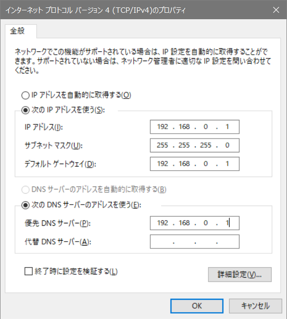

# 山口大学工学部 ワークショップ 2019  解説資料


---

## 第7章 その他の情報

本章では、Raspberry Piで何かデバイスを作るときに知っておくと便利な情報を掲載している。

---

### 1.シェルスクリプト

キーボードで毎回ターミナルにコマンドを入力する代わりに、入力したいコマンドをファイルに書いておいて、そのファイルを実行させると便利である。  
これは特に、コマンドが長く複雑なときや、コマンドがいくつもあるようなとき、また、同じコマンドをたびたび実行する必要があるときなどに便利である。  
そのようなファイルのことを「シェルスクリプト」という。シェルスクリプトは拡張子が`.sh`である。シェルスクリプトはプログラミング言語の一種であるといえる。

簡単な例を通してシェルスクリプトの振る舞いについて理解しよう。  
まず、ターミナル上で以下のコマンドを実行する。

`$date >> /home/pi/date.txt`

`/home/pi/date.txt`が生成されている。`date.txt`を開いて内容を確認する。

`$cat /home/pi/date.txt`

実行した日付時刻が記録されているはずである。  
このことから、`$date >> /home/pi/date.txt`は、`/home/pi`以下に、実行時点の日付時刻が記録された`date.txt`というテキストファイルを生成するコマンドであることが分かる。

次に、シェルスクリプトで同じことをやってみよう。`record_date.sh`を作成する。

`$sudo nano /home/pi/record_date.sh`

`record_date.sh`には以下の内容を記述する。

```
#!/bin/bash
date >> /home/pi/date.txt
```
入力を終えたら保存し、nanoを終了する。

シェルスクリプトに書く内容は、ターミナル上に入力する内容と同じである。コマンドをどこに入力するかの違いでしかない。シェルスクリプトには、複数のコマンドを記述しておくこともできる。コマンドは一行に1つ記述する。コマンドは上から順に実行される。

シェルスクリプトを実行する前に、実行権限を付与しておく。

`$sudo chmod a+x /home/pi/record_date.sh`  
`$sudo chmod a+w /home/pi/date.txt`  

`record_date.sh`を実行する。

`$./record_date.sh`

`date.txt`を確認してみよう。

`$cat /home/pi/date.txt`

---

### 2.プログラムの自動起動(/etc/rc.local)

Raspberry Piが起動したときに、何らかのプログラムを自動で実行させたいことがある。このようなことを実現するにはいくつかの方法がある。

この章では、`/etc/rc.local`を用いる方法を紹介する。  
`/etc/rc.local`による自動起動の方法はとても簡単である。起動時に実行したいプログラムを、`/etc/rc.local`に記述しておくだけでよい。

実行させたいプログラムには実行権限が付与されていなければならない。

`$sudo chmod a+x /home/pi/record_date.sh`  

`/etc/rc.local`を開く。

`$sudo nano /etc/rc.local`

`/etc/rc.local`末尾の、`exit 0`と記述されている行の一行上に、実行したいプログラムやコマンドを絶対パスで記述する。プログラム内でディレクトリやファイルを指定するときも絶対パスでなければならない。

`/home/pi/record_date.sh`  

追記出来たらnanoを終了。Raspberry Piを再起動してから、`date.txt`を確認してみよう。

`$cat /home/pi/date.txt`

---

### 3.プログラムの一定間隔での実行(cron)  

Linuxには「cron」と呼ばれる仕組みがあり、これを用いると、プログラムを一定間隔で実行することができる。  
以下、Raspberry Piでcronを使用する方法について述べる。

cronはエラー発生時などにメールを送信する機能を持っている。この機能は必ずしも使用しなくてもよいが、メールを送信するソフトがインストールされていないとcronがうまく動作しないので、インストールしておく。

`$sudo apt-get install postfix`

インストールの途中で「メールを使用するか」のように聞かれたら「No」と答えておく。

準備ができたところで、cronを設定する。実行したいプログラムや処理をcronに登録するためには、crontabを編集する。

`$sudo crontab -e`

編集に使用するエディタを選択するよう要求されたら、適当なものを選ぶ（nanoを推奨）。デフォルトではnanoを使用する設定になっている。

crontab末尾に、実行したい処理と実行間隔を記述する。crontabの記述方法については以下を参照。

[http://make.bcde.jp/raspberry-pi/決まった時間に処理する](http://make.bcde.jp/raspberry-pi/%E6%B1%BA%E3%81%BE%E3%81%A3%E3%81%9F%E6%99%82%E9%96%93%E3%81%AB%E5%87%A6%E7%90%86%E3%81%99%E3%82%8B/)

設定を終えたら`$sudo reboot`。再起動後に設定が有効になっている。

※注意:`$crontab -r`とすると、cronの設定が削除されてしまう。crontabを開く`e`と、削除する`r`のキーが隣接していることから、crontabを設定しようとして誤って削除してしまう事故が多発している。タイピングには細心の注意を払おう。

---

### 4.IPアドレスの固定(/etc/dhcpcd.conf)

コンピュータ（もちろんRaspberry Piも含まれる）がネットワークを介して他のマシンと通信するときには、個々のマシンに「IPアドレス」が付与されている必要がある。IPアドレスはインターネットにおける識別番号で、現実世界でいう住所のようなものである。宅配便などを届けようとするときには、送り先の住所がわかっていないと正しく届けることができない。これと同じように、ネットワークでコンピュータがデータをやり取りしようとするときには、IPアドレスが必要なのである。

ネットワークを利用しようとするユーザが、自分のマシンにいちいちIPアドレスを設定するのは煩雑である。そこで、多くのネットワークでは「DHCP」という仕組みが機能しており、ネットワークに接続したマシンには、ルータなどによって自動的に適切なIPアドレスが割り振られる。これによって、利用者はIPアドレスについて気にすることなくネットワークを利用できるのである。山口大学情報コンセントも、接続したマシンに対して基本的にはDHCPによって適当なIPアドレスが割り当てられている。

その一方で、2台以上のマシンを接続して自分でネットワークを構築するような場合には、各マシンのIPアドレスを自分で決定した方が都合がよい。このような場合にはDHCP機能はかえって邪魔者である。  
そこで、Raspberry PiでIPアドレスを自分で任意のものに固定する方法を解説する。本ワークショップでは、他のネットワーク環境との干渉を避けるため、アイ・オー・データ機器製のルータを用いて、閉じられた独自のネットワーク（LAN）を構築する。

※注意:IPアドレスを自分で勝手に決定したRaspberry Piを山口大学のネットワークに接続しても、正常に動作しない。  
本項の内容を試すときには、Raspberry Piをyunet（無線/有線）から切り離しておく。その後、LANケーブルを用いて、Raspberry Piとルータを接続する。

Raspberry PiのIPアドレスを設定するには、以下のファイルを編集する。

`$sudo nano /etc/dhcpcd.conf`

`/etc/dhcpcd.conf`末尾に以下の内容を追記する。これは、Raspberry Piの有線LANポートの設定である。

```
interface eth0
static ip_address=192.168.0.***/24
static routers=192.168.0.1
static domain_name_servers=192.168.0.1

※***の部分には、2～254までの好きな番号を入力する。その際、他の人と被らないように気を付ける。
```

再起動すると設定が反映されている。

※注意:ふたたびyunetに接続するときには、上記の設定を`#`でコメントアウトしておく。

---

### 5.SSHによるリモートログイン、SFTPによるファイル転送

ノートPCからネットワークを通じてRaspberry Piに遠隔ログインしたり、Raspberry PiとPC間でファイル転送する方法について解説する。  
この方法を使用すれば、Raspberry Piにマウス・キーボード・モニタを接続することなしに開発できるため、便利である。

0.Raspberry PiでSSH接続を有効にする。`raspi-config`の`Interfacing Option`内にある。

`$sudo raspi-config`

1.ノートPCに以下のソフトウェアをインストールしておく。

- [Tera Term](https://forest.watch.impress.co.jp/library/software/utf8teraterm/)

  - ノートPCからRaspberry PiにSSHログインするためのソフト。

- [WinSCP](https://forest.watch.impress.co.jp/library/software/winscp/)  
  
  - ノートPCからRaspberry Piにファイル転送するためのソフト。

本項の以下の内容は、項目4.の条件（Raspberry Piをyunetから切り離し、アイ・オー・データ機器製のルータにLANケーブルで有線接続され、IPアドレスが固定されていること）で試されることを想定している。

2.ノートPCをルータに接続する。有線/無線のどちらでもよい。

3.ノートPCのIPアドレスを確認する。コマンドプロンプトを起動し、`ipconfig`と入力する。

4.Tera Termを起動し、「ホスト」の欄に自分のRaspberry PiのIPアドレスを入力する。ユーザIDやパスワードを聞かれたときには、  
ID:pi  
PASS:raspberry  
と入力する。

5.接続に成功すると黒いターミナルが現れる。これはRaspberry Piのターミナルであり、ここに入力したコマンドはRaspberry Piで実行される。Raspberry Piの遠隔操作である。

6.winSCPを起動し、先ほどと同様に、自分のRaspberry PiのIPアドレスを入力して接続する。

7.Windowsの「エクスプローラ」のような、フォルダがいくつか並んだ画面が現れる。これはRaspberry Piのフォルダ（`/home/pi`）を表している。  
この画面上でファイルを削除すると、実際に消えるのはRaspberry PiのmicroSD上のファイルである。  
また、winSCPからRaspberry Pi上のファイルを編集することもできる。

8.winSCPの画面上に見える`/home/pi`内の適当なファイル（.pyファイルなど）をドラッグアンドドロップでWindowsのデスクトップに移動してみる。するとファイル転送（ネットワークを介してRaspberry PiからWindowsPCへファイルが移動される）が行われる。このようにすると、USBメモリなどを使用せずともPCとRaspberry Pi間でデータをやりとりできる。  
例えば、ソースコードをPC上で編集し、完成したものをファイル転送機能でRaspberry Piに送って実行する、などである。

---

### 6.RDPによるリモートデスクトップ接続(xrdp)

リモートデスクトップ機能を用いると、Raspberry Piの表示画面をネットワークを通じて他のPCから閲覧することができる。これを使えばますますモニタはいらなくなる。

1.Raspberry Piに`xrdp`をインストールする。`tightvncserver`は`xrdp`が動作するために必要。

`$sudo apt-get install tightvncserver`  
`$sudo apt-get install xrdp`  
`$sudo reboot`  

2.インストールが終了したら、Raspberry Piをyunetから切り離し、Raspberry PiのIPアドレスを固定するよう、`/etc/dhcpcd.conf`を再度設定する（`#`を消し、設定を再度有効にする）。設定が完了したら再起動し、アイ・オー・データ機器製のルータにLANケーブルで有線接続する。

3.ノートPCをルータに接続する。有線/無線のどちらでもよい。

4.Windowsに標準で付属している「リモートデスクトップ接続」ツールを起動する。スタートメニューの「Windowsアクセサリ」内にある。  
Raspberry PiのIPアドレス・ユーザID・パスワードを入力する。

5.ノートPC上にRaspberry Piのデスクトップが現れる、ここから、マウスなどを用いてRaspberry Piを遠隔操作することができる。  
Raspberry Piにモニタを接続するのと何ら変わりなく使用することができる。ただし一部のGUI(OpenCVの画像表示など)は正常に機能しない。

---

### 7.Raspberry PiとPCを直接LANケーブルで接続

ルータを用いず、Raspberry PiとPCを直接LANケーブルで接続することもできる。  

0.Raspberry PiのIPアドレスは今までの手順によって固定されているものとする。

1.PCのIPアドレスを固定する。  
コントロールパネル -> ネットワークとインターネット -> ネットワークと共有センター -> （左上の方にある）アダプターの設定の変更 -> イーサネット（ダブルクリック） -> プロパティ を開く。  
インターネット・プロトコルバージョン４(TCP/IPv4) を選択してプロパティをクリック。  

2.以下のように設定を入力し、「OK」をクリック。



3.Raspberry PiのLANポートとPCのLANポートをLANケーブルで直結する。

4.これまでと同様に、Tera TermやwinSCP、リモートデスクトップ接続などが使用できる。

---

[前の章へ](https://yu-workshop2019.github.io/chapter_6/chapter_6)


[次の章へ](https://yu-workshop2019.github.io/chapter_8/chapter_8)


[目次へ](https://yu-workshop2019.github.io/manual)


[トップページへ](https://yu-workshop2019.github.io/)
