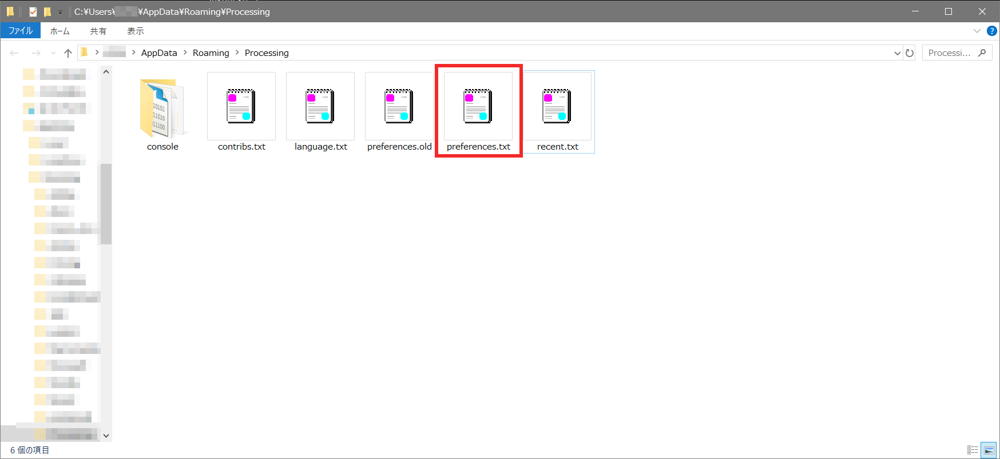

<style>
  .image_center {
        display: block;
        margin-left: auto;
        margin-right: auto;
  }
</style>

## Processingのダウンロード方法や、学内での使用方法について解説しています。


### Processingのダウンロード

以下のダウンロードサイトからProcessingをダウンロードする。

[https://processing.org/download/](https://processing.org/download/)


通常は、「Windows 64bit版」を選択する。  
ダウンロードしたzipファイルを適当な場所で解凍するだけで使用可能。

---

### プロキシの設定

学内で、ネットワーク経由でProcessingにライブラリを追加するためには以下の設定を行う。

1．Processingを起動

2.ファイル -> 設定 をクリック


3.ウィンドウ下部の「詳細な設定は、次のファイルを編集することで可能です」の下の行をクリック  
例）`C:\Users\USERNAME\AppData\Roaming\Processing\preferences.txt`


4.フォルダが開く


5．Processingを閉じる

6.開いたフォルダ内の`preferences.txt`をメモ帳などで開く  
`preferences.txt`が見当たらず、代わりに`preferences.old`が2つあるようなときには、キーボードの「`F5`」キーを押すと、`references.txt`が現れる。  


7.`preferences.txt`の93～96行目に以下のような記述を書き加える

```
＜変更前＞
proxy.http.host=
proxy.http.port=
proxy.https.host=
proxy.https.port=

＜変更後＞
proxy.http.host=proxy.cc.yamaguchi-u.ac.jp
proxy.http.port=8080
proxy.https.host=proxy.cc.yamaguchi-u.ac.jp
proxy.https.port=8080
```



8.`preferences.txt`を上書き保存

9.Processingを再び起動

10.追加のライブラリがインストールできるようになる


より詳細な情報については以下のWebページを参照

[Processing3をプロキシ環境下で使う](https://sites.google.com/site/jglabo701/processing3wopurokishi-huan-jing-xiade-shiu)
