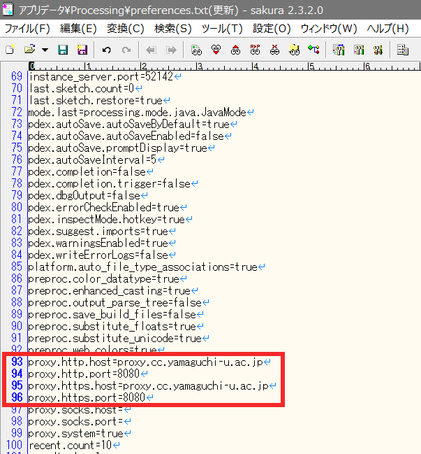

<style>
  .image_center {
        display: block;
        margin-left: auto;
        margin-right: auto;
        margin-top: 10%;
        margin-bottom: 10%;
        width: 70%;
        object-fit: contain;
        border: none;
  }
</style>

## Processingのダウンロード方法・学内での使用方法


### Processingのダウンロード

以下のダウンロードサイトからProcessingをダウンロードする。

[https://processing.org/download/](https://processing.org/download/)

<a href="img1.png"> </a>

通常は、「Windows 64bit版」を選択する。  
ダウンロードしたzipファイルを適当な場所で解凍するだけで使用可能。

---

### プロキシの設定

<font color="red"><u>学内で、ネットワーク経由でProcessingにライブラリを追加</u></font>するためには以下の設定を行う。

1．Processingを起動


2.ファイル -> 設定 をクリック

<a href="img3.png"> </a>


3.ウィンドウ下部の「詳細な設定は、次のファイルを編集することで可能です」の下の行をクリック  
例）`C:\Users\USERNAME\AppData\Roaming\Processing\preferences.txt`

<a href="img3.png"> </a>


4.フォルダが開く

<a href="img4.png"> </a>


5．Processingを閉じる


6.開いたフォルダ内の`preferences.txt`をメモ帳などで開く  
※`preferences.txt`が見当たらず、代わりに`preferences.old`が2つあるようなときには、キーボードの「`F5`」キーを押すと、`preferences.txt`が現れる

<a href="img5.png"> </a>


7.`preferences.txt`の93～96行目に以下のような記述を書き加える


```
＜変更前＞
proxy.http.host=
proxy.http.port=
proxy.https.host=
proxy.https.port=

＜変更後＞
proxy.http.host=proxy.cc.yamaguchi-u.ac.jp
proxy.http.port=8080
proxy.https.host=proxy.cc.yamaguchi-u.ac.jp
proxy.https.port=8080
```

＜変更前＞
<a href="img6.png"> </a>


＜変更後＞
<a href="img7.png"> </a>


8.`preferences.txt`を上書き保存


9.Processingを再び起動


10.追加のライブラリがインストールできるようになる

<a href="img8.png"> </a>


より詳細な情報については以下のWebページを参照

[Processing3をプロキシ環境下で使う](https://sites.google.com/site/jglabo701/processing3wopurokishi-huan-jing-xiade-shiu)

＜注意＞
※<font color="red"><u>学外で、</u></font>ネットワーク経由でProcessingにライブラリを追加するためには上記の設定（プロキシ設定）は<font color="red"><u>不要。設定を元に戻す。</u></font>  
具体的には、追加した行（93～96行目）の行頭に"#"をつけることで無効化できる。


### サンプルプログラム

ファイル -> サンプル から、さまざまなサンプルプログラムを試すことができる。

Processingでできることについては以下のサイトも参考になる。

[https://processing.org/examples/](https://processing.org/examples/)

[https://processing.org/examples/follow3.html](https://processing.org/examples/follow3.html)

